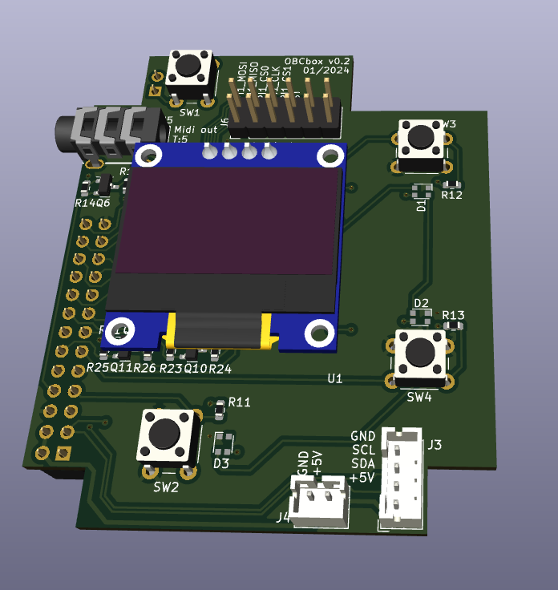

# KiCad_obcbox
Hardware of the obcbox-project. This PCB is designed for a raspberry pi 3 B+ and an 0.96" OLED screen (be careful with the display-pinout!)
* Software (main): [java-BC](https://github.com/kokospalme/java-BC/tree/obcbox)
* Software (gui): [obcgui](https://github.com/kokospalme/obcgui/)
* Hardware (pcb): [KiCad_obcbox](https://github.com/kokospalme/KiCad_obcbox)
* Hardware (case): [grabcad](https://grabcad.com/library/obcbox-enclosure-v1-0-1)

# Status quo

* [v0.2 is working](https://github.com/kokospalme/KiCad_obcbox/releases)
